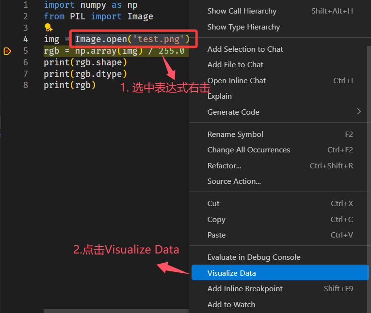
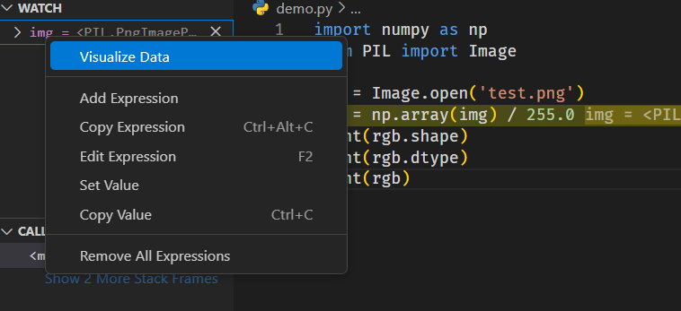
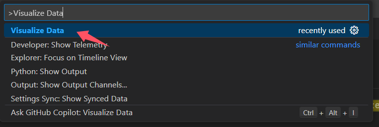
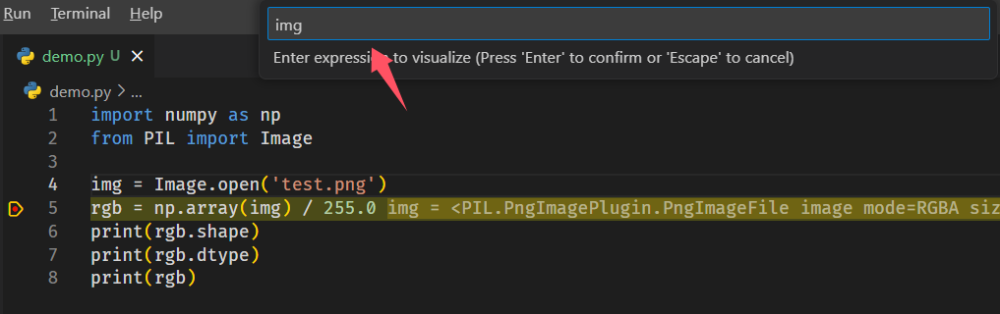
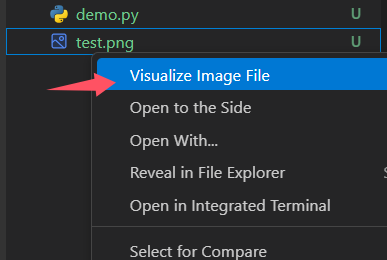

# VS Code 图像数据可视化插件

## 插件概述

本插件用于在 VS Code 中可视化显示多维数组（如 NumPy 数组）或张量格式的图像数据、图像文件，支持多通道浮点数据的显示与交互。适合调试和可视化分析图像数据、特征图、深度图等多通道图像格式数据。

---

## 主要功能

- **多通道数据支持**  
  支持单通道（灰度图）、三通道（RGB）和四通道（RGBA）数据的显示，且支持多通道切换与“全部通道同时显示”。

- **数据格式兼容**  
  支持两种主流维度格式与切换：  
  - HWC（Height-Width-Channel）  
  - CHW（Channel-Height-Width）

- **归一化显示**  
  支持对图像数据进行归一化处理，方便显示浮点范围较大的数据。

- **伪彩色映射**  
  支持灰度显示和 JET 伪彩色映射，便于观察数据的细节和分布。

- **缩放与拖拽**  
  支持使用鼠标滚轮（按 Ctrl）进行缩放，并支持鼠标拖拽平移图像，实现灵活查看。

- **像素值查看**  
  鼠标悬停时显示当前像素坐标和对应的像素值，支持单通道和多通道数据展示。

- **数据统计信息**  
  展示数据的最大值、最小值、均值和方差，方便快速了解数据特征。

- **导出与复制**  
  支持将当前画布内容导出为 PNG 图片或复制到剪贴板，方便后续分享与保存。

---

## 源码安装说明

### 1. 克隆源码仓库
```bash
git clone https://github.com/your-repo/image-data-visualizer.git
cd visualizer
```
### 2. 安装依赖
```bash
# 确保已安装 Node.js
npm install
```
### 3. 编译插件
```bash
npm run compile
tsc -p .
```
### 4. 打包插件 
```bash
npm install -g vsce
vsce package
# 生成的 .vsix 文件可通过 VS Code 扩展面板“从 VSIX 安装...”进行安装。
```
**手动安装**：直接从 [Release 页面](https://github.com/linsun449/visualizer/releases) 下载 `.vsix` 文件，然后在 VS Code 中通过“扩展”侧栏右上角的“···”菜单选择“从 VSIX 安装...”进行安装。

## 使用方法

### 1.在editor中打开



### 2.在watch监控中打开


### 3.在顶部手动输入表达式




### 4.右击图像文件直接打开


